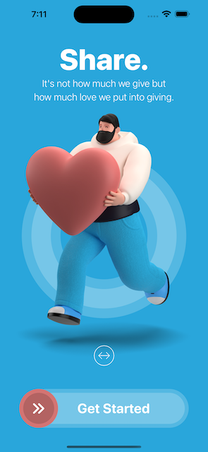
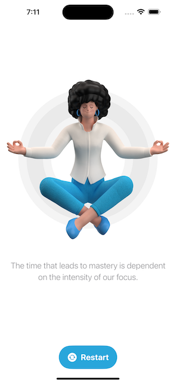

# [Giangbb Studio]

# project 01 - Restart App

  
  

## Getting Started with SwiftUI - Developing a Home Screen with Sliding Animation

- Get started with SwiftUI
- Working with complex SwiftUI Drag Gesture
- Working with SwiftUI Animation
