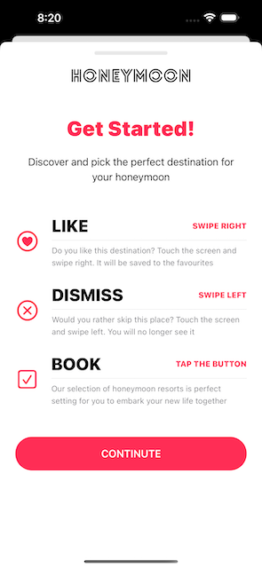

# [Giangbb Studio]

# project 10 - Honeymoon App

  
  
  
  

## Honeymoon App

- How to build up the layout of the individual Honeymoon Card view
- Develop the Header layout of the Honeymoon App with SwiftUI
- Develop the Footer layout of the Honeymoon App with SwiftUI
- How to create reusable components and write less code with SwiftUI
- Show views with Binding and dismiss views with Environmental objects
- How to develop the Swiping Motion with SwiftUI
- Implementing new haptic feedbacks (success) and playing sound effects
