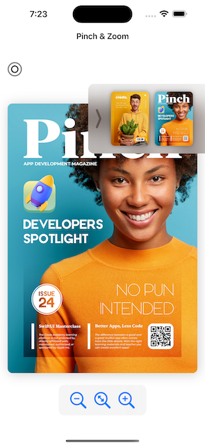
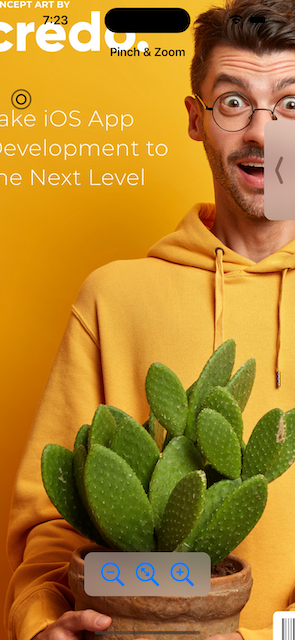

# [Giangbb Studio]

# project 02 - Pinch App

  
  

## Working with SwiftUI Gestures - Developing a pinch app

- Working with SwiftUI Double Tap Gesture
- Working with SwiftUI Drag Gesture
- Working with SwiftUI Long Press Gesture
- Working with SwiftUI Control Interface
- Working with SwiftUI Magnification Gesture
