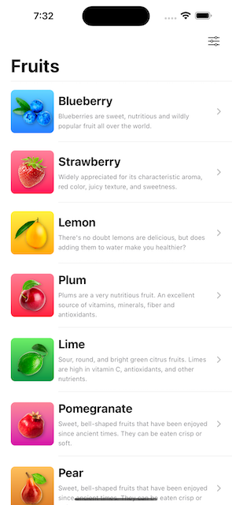

# [Giangbb Studio]

# project 03 - Fruits App

  
  
  
  

## Fruits App

- Learn how to create an Onboarding Screen using the new Page Tab View
- Learn how to create data model and fetch data using Swift
- Learn how to use App Storage and understand the new SwiftUI App Life Cycle
- Learn how to create List View and retrieve data using ForEach loop
- Learn how to create a detail view layout in SwiftUI
- Learn how to create a Settings View in SwiftUI
