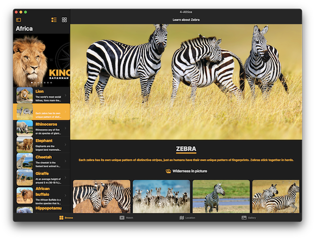
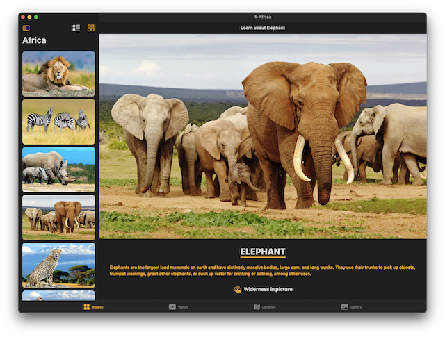
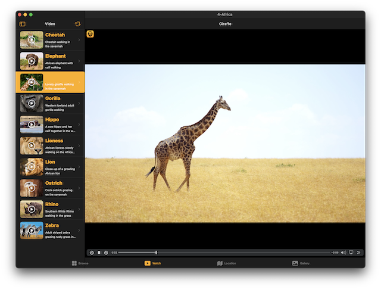
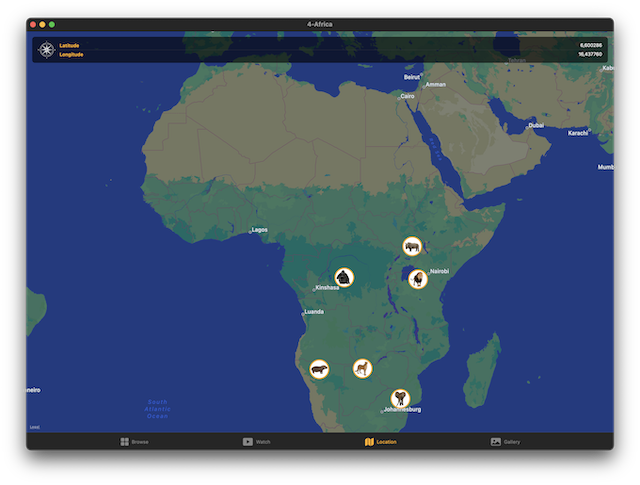
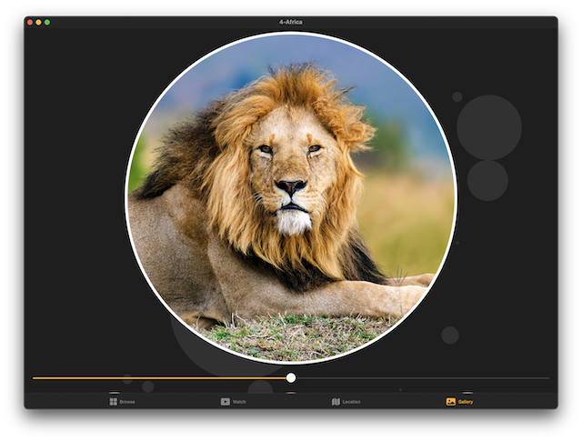
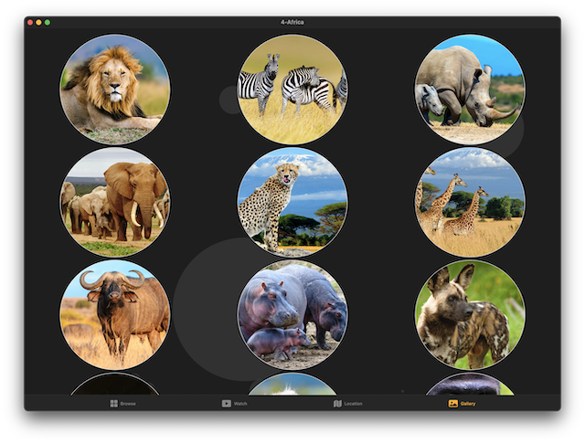
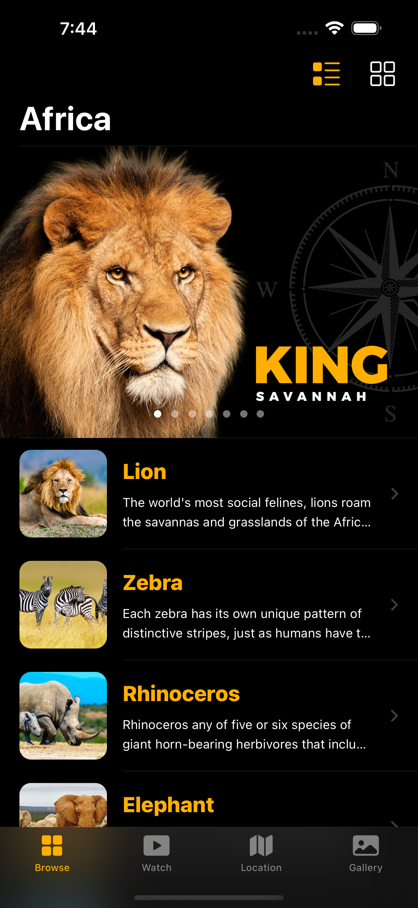
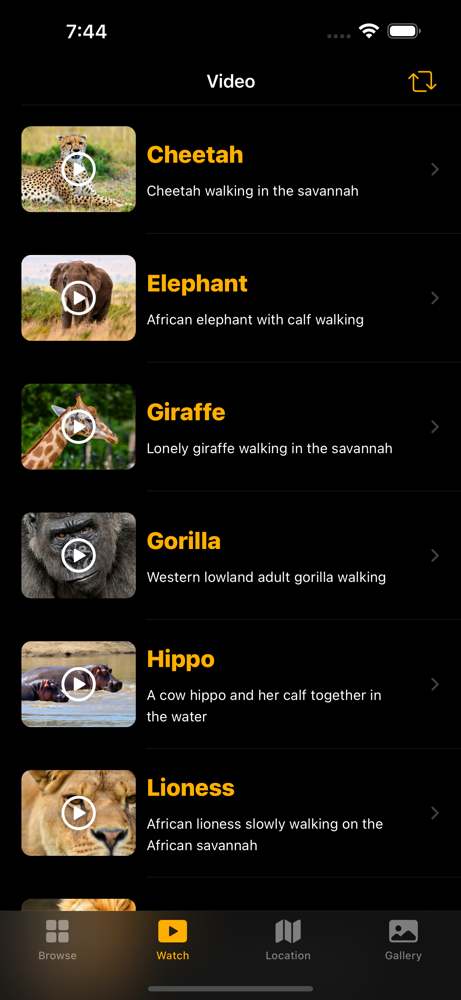
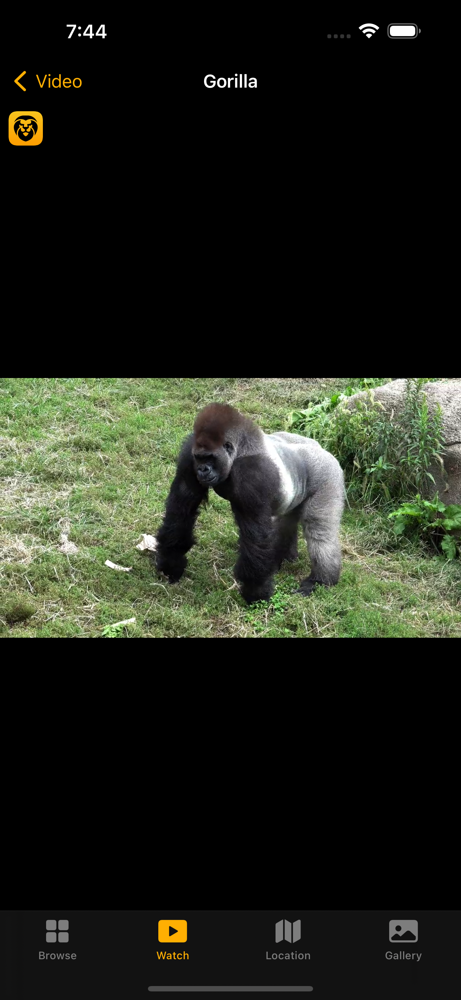
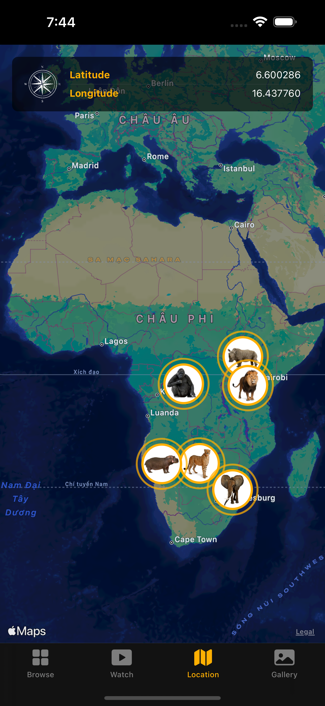

# [Giangbb Studio]

# project 04 - Africa App

  
  
  
  
  
  

  
  
  
  
  

## Africa App - Create an responsive app to work on all iOs, ipadOS macOS devices with SwiftUI

- Learn how to decode a JSON file and fetch data with SwiftUI
- Create a dynamic SwiftUI List using Swift Generics and JSON data
- Develop the detail view for each animal with dynamic data
- Working with Video Player of SwiftUI framework
- Develop a complex Map with custom Annotations in SwiftUI
- Learn how to create a motion animation programmatically with SwiftUI
- Create a photo gallery with Grid Layout using SwiftUI
- Develop a complex Grid Layout system with four Toolbar Buttons
- Create a new iMessage Extension (iOS Sticker Pack)
- Transfer the iPad app to desktop Mac app with Mac Catalyst technology
