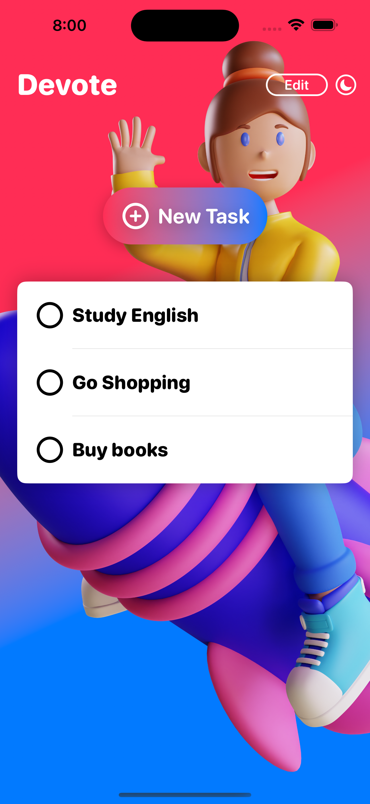
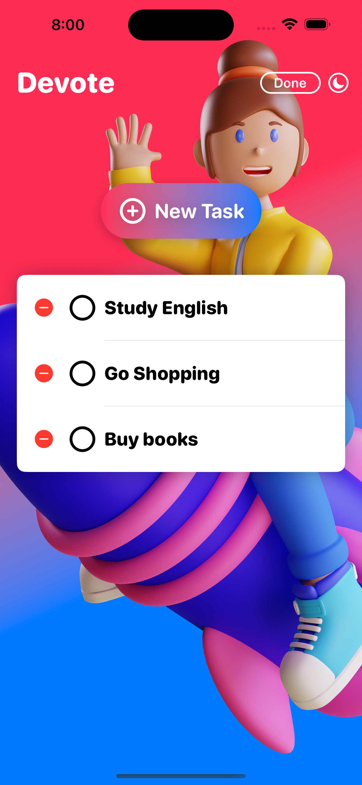
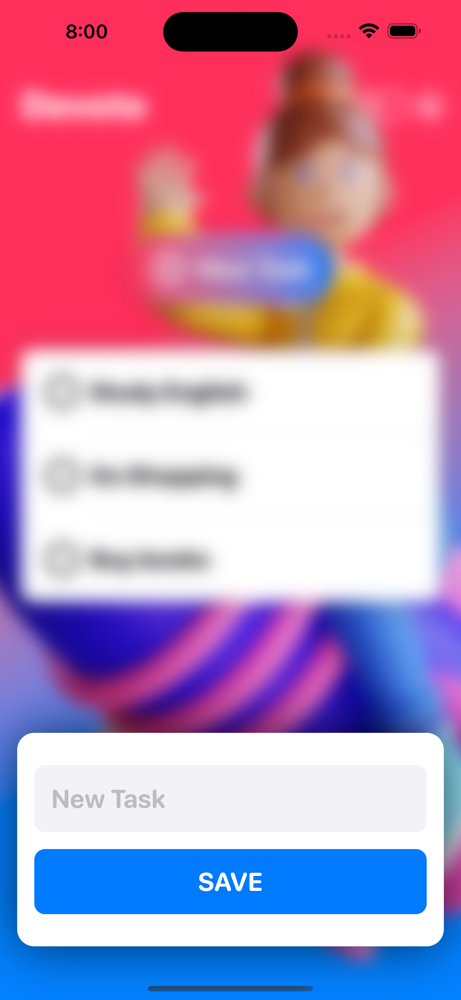

# [Giangbb Studio]

# project 06 - Devote App

  
  
  

## Devote App - Working with Core Data

- Develop a stellar app design
- Create a new entry form for the task item
- Develop a custom header
- Learn how to create a custom visual effect in SwiftUI
- Dealing with UX and Sound Design
