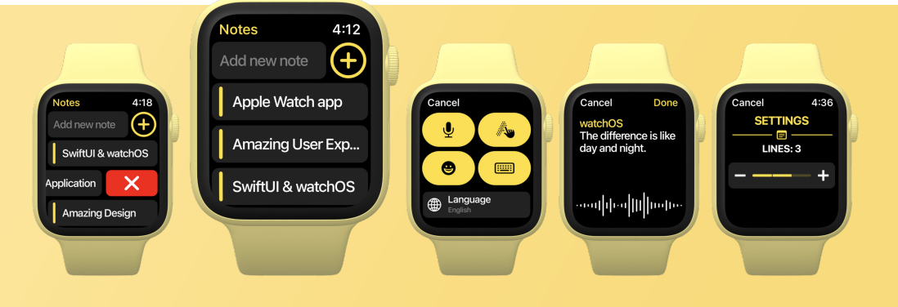

# [Giangbb Studio]

# project 07 - Watch Notes App

  

## Watch Notes App - Apple watch application with SwiftUI

- Get familiar with Apple Watch input interfaces
- Storing and reading data with SwiftUI on Apple Watch
- Create a detail view for a note
- Create the Credits view
- Develop a new feature and the Settings page
