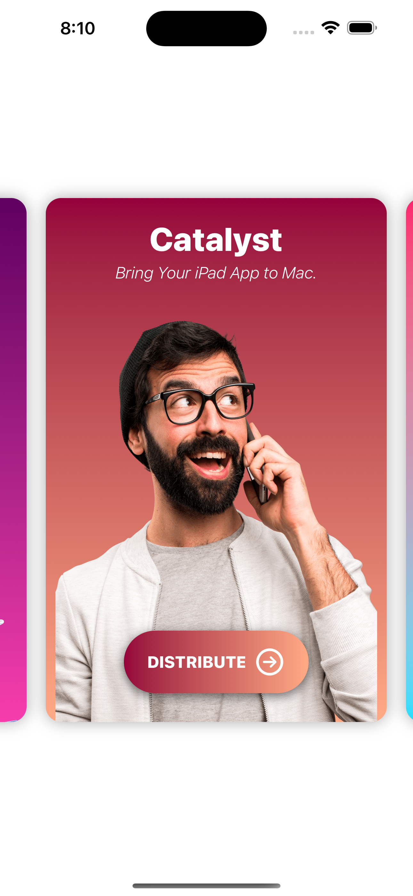

# [Giangbb Studio]

# project 08 - Learn By Doing App

  

## Learn By Doing App

- How to create a launch screen in iOS
- Create a card view in SwiftUI
- Repeating content effortlessly with For Each loop
- Play a sound file with AVFoundation in SwiftUI
- Working with SwiftUI Animation
- Working with Haptic Feedback
- How to show Alert window in SwiftUI
- How to create Stickers for the mobile app
