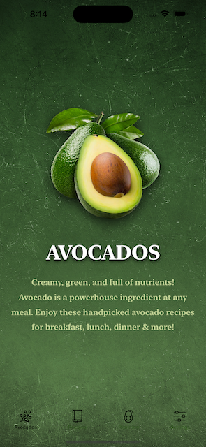
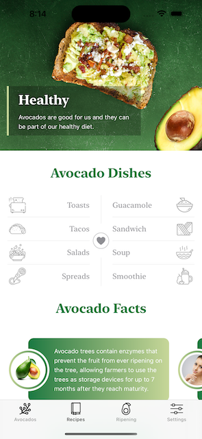
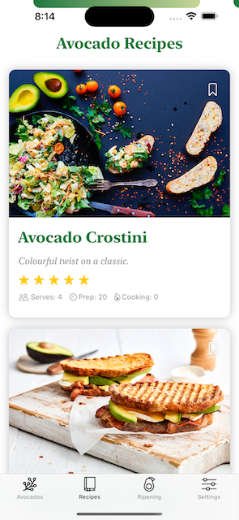
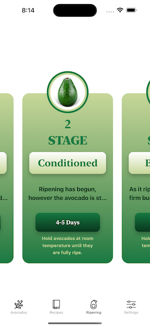
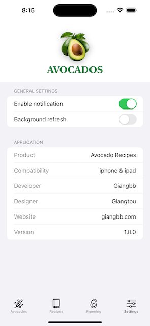

# [Giangbb Studio]

# project 09 - Avocado App

  
  
  
  
  

## Avocado App

- Supporting Dark Mode in iOS App Interface with SwiftUI
- Create a user interface with tabs (TabView) in SwiftUI
- Build the Avocado home view with SwiftUI animation
- Design the layout of the header in Xcode
- How to create a interesting layout with SwiftUI: Best Dishes with Avocado
- How to Present a New View with using SwiftUI Sheets
- How to Build a Basic Form UI for iOS with SwiftUI
