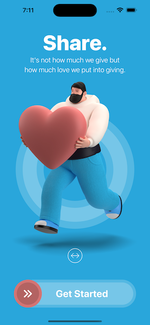
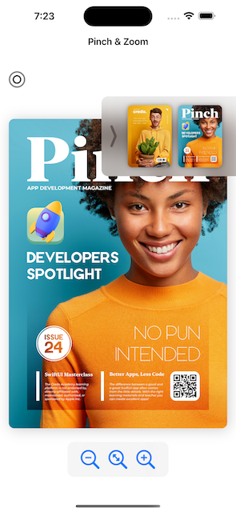
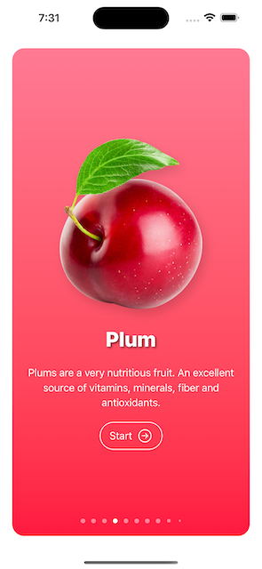
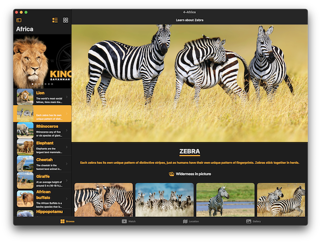
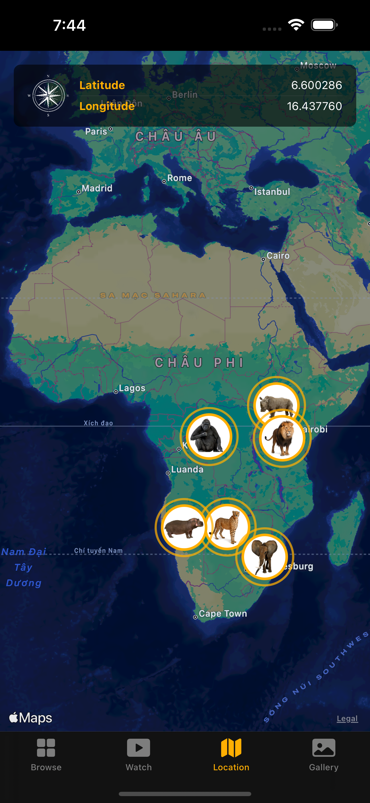
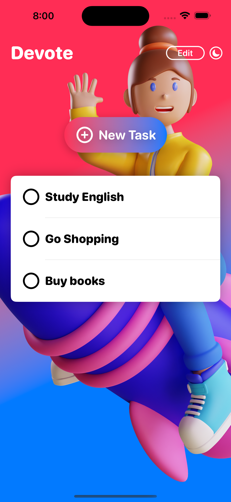
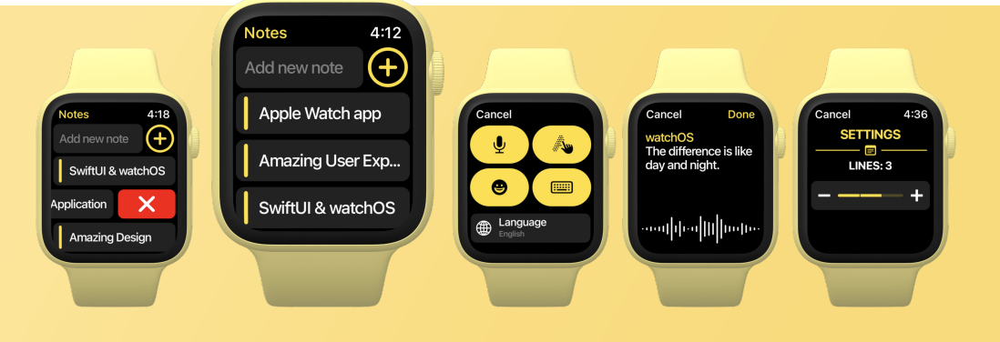
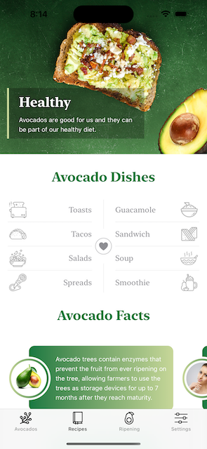
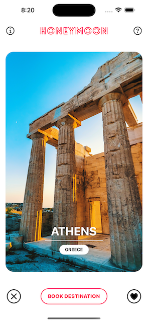

# [Giangbb Studio]

# SwiftUI A-Z

A series of SwiftUI projects from easy to advanced

  
  
  
  
  
  
  
  
  

#

## project 01 - Restart App

- Getting Started with SwiftUI - Developing a Home Screen with Sliding Animation

## project 02 - Pinch App

- Working with SwiftUI Gestures - Developing a pinch app

## project 03 - Fruits App

- Learn how to create an Onboarding Screen using the new Page Tab View
- Learn how to create List View and retrieve data using ForEach loop
- Learn how to create a Settings View in SwiftUI

## project 04 - Africa App

- Create an responsive app to work on all iOs, ipadOS macOS devices with SwiftUI

## project 05 - Touchdown App

- Create an E-commerce app UI/UX design with SwiftUI

## project 06 - Devote App

- Working with Core Data

## project 07 - Watch Notes App

- Apple watch application with SwiftUI

## project 08 - Learn By Doing App

- Create a launch screen in iOS

## project 09 - Avocado App

- Supporting Dark Mode in iOS App Interface with SwiftUI

## project 10 - Honeymoon App

- Build up the layout of the individual Honeymoon Card view
